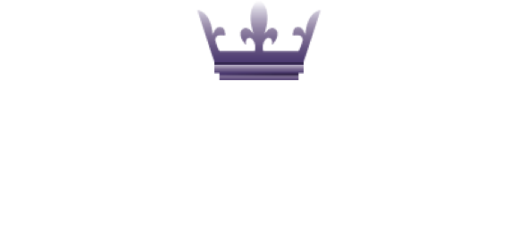

<p align="center">
  
</p>

<p align="center">
  <a href="#">Português</a> · <a href="/docs/readme_en.md">English</a>
</p>

# 🔍Índice <!-- omit in toc -->
- [Tecnologias](#tecnologias)
- [Visão Geral](#visão-geral)
- [Guia de Instalação](#guia-de-instalação)
- [Como Usar o Projeto?](#como-usar-o-projeto)
- [Recursos Adicionais](#recursos-adicionais)
  - [Ferramentas](#ferramentas)
  - [Linguagens e Pacotes](#linguagens-e-pacotes)
  - [Guias de Referência](#guias-de-referência)

# 💻Tecnologias

<table align="center"><tr>
  <td valign="top" width="25%">
      
  ### <div align="center"> Front-End </div>
      
  <p align="center">
    
  </p>
  </td>
  
  <td valign="top" width="25%">

  ### <div align="center"> Back-End </div>

  <p align="center">
    
  </p>
  </td>
  
  <td valign="top" width="25%">

  ### <div align="center"> Database </div>

  <p align="center">
    
  </p>
  </td>

  <td valign="top" width="25%">

  ### <div align="center"> Cloud </div>

  <p align="center">
    
  </p>
  </td>
</tr></table>


# 📝Visão Geral
  Se você vive e respira Rock 'n' Roll, o Rocking é o seu novo paraíso! Imagine uma plataforma onde cada riff, solo e batida do seu gênero favorito é celebrado com uma enxurrada de informações atualizadas, coletâneas épicas, métricas intrigantes e insights profundos. Rocking não é apenas uma plataforma; é um verdadeiro palco digital que traz o melhor do Rock Global diretamente para você. Conecte-se com a batida que faz seu coração pulsar mais forte, descubra novos sons e mergulhe na rica história e evolução desse gênero icônico. Junte-se à revolução musical com Rocking!

  Rocking é uma plataforma projetada para oferecer uma experiência imersiva e dinâmica aos amantes do Rock, trazendo informações, coletâneas e insights sobre esse gênero musical. Desenvolvida com HTML, CSS e JavaScript, a aplicação é leve, responsiva e acessível, com deploy realizado nos serviços da Azure para garantir alta disponibilidade e desempenho.

  A Rocking conecta-se a um banco de dados MySQL local, utilizando o MySQL Workbench para desenvolvimento e testes, e integra-se a um banco de dados PSQL na nuvem através da plataforma Neon. A aplicação conta com uma API robusta, desenvolvida em Node.js, para gerenciar as operações de backend, assegurando uma interação fluida e segura entre o frontend e os dados.

# 📖Guia de Instalação
  Siga as etapas abaixo para configurar e executar a Rocking em seu ambiente local, o processo pode ser mais fácil com uma ferramenta de edição de texto avançada como o Visual Studio Code:

1. Usando o git bash clone este repositório:
   ```
   git clone https://github.com/Paulo-Alvares/Rocking.git
   ```
   
2. Navegue até o diretório do projeto:
   ```
   cd rocking
   ```

3. Instale as dependências:
   ``` 
   npm i
   ```

4. Inicie o servidor de desenvolvimento:
   ``` 
   npm start
   ```

5. Acesse a Rocking em seu navegador:
   ```
   http://localhost:3000
   ```
   
# 💡Como Usar o Projeto?
* Exploração de Bandas e Álbuns <br>

  Navegue pela vasta coleção de informações sobre bandas, álbuns e músicas de Rock. Use a barra de pesquisa para encontrar suas bandas favoritas e descobrir novas, acessando detalhes como discografias, datas de lançamentos e análises de álbuns.

* Acompanhamento de Tendências no Rock <br>
  
  Explore as métricas e insights disponíveis para identificar tendências no mundo do Rock, como os álbuns mais ouvidos, bandas em ascensão, ou até mesmo a evolução de gêneros específicos ao longo do tempo.

* Exploração da História do Rock <br>

  Use o Rocking para mergulhar na rica história do Rock, explorando a evolução do gênero desde suas raízes até o cenário contemporâneo. Acesse artigos e conteúdos que contextualizam momentos-chave, influências culturais e transformações no estilo.

* Descoberta de Novos Artistas <br>

  Descubra novas bandas e músicas baseadas no seu gosto musical. Explore artistas emergentes que estão moldando o futuro do Rock, com recomendações para seu perfil.

# 🔗Recursos Adicionais
### 🎨Design
  - <a href="https://www.figma.com/design/nK8Mw4SzvXJs4CiVYrQdn3/Rocking?node-id=0-1&t=XlhtY4Zh0NDoWsuX-1">Protótipo</a>
  - <a href="https://fonts.google.com/share?selection.family=Montserrat:ital,wght@0,100..900;1,100..900|New+Rocker">Fontes</a>
  - <a href="https://fontawesome.com/">Ícones</a>


### 🔧Ferramentas
  - <a href="https://code.visualstudio.com/download">Visual Studio Code</a>
  - <a href="https://www.figma.com/">Figma</a>
  - <a href="https://dev.mysql.com/downloads/workbench/">MySQL Worckbench</a>
  

### 📦Linguagens e Pacotes
  - <a href="https://nodejs.org/en/download/package-manager">Node</a>
  - <a href="https://neon.tech/">Neon</a>
